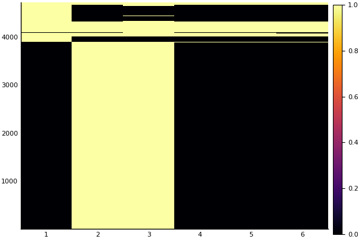
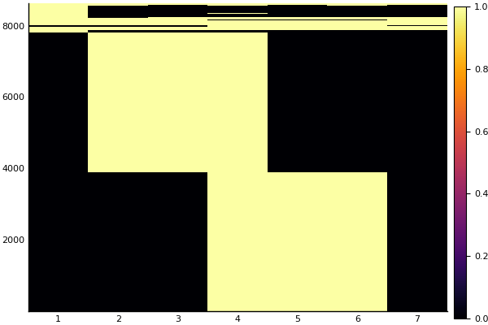

# Proof of Concept

To verify that captured traces are behaving as expected, two synthetic workloads were
written in `c++` with predictable memory access patterns. These test files can be found
in `deps/src/` and can be built either with the `Makefile` in `deps/` or by using Julia's
package building functionality with the following 
```julia
# Switch to PKG mode
julia> ]

# Build SystemSnoop - automatically building test workloads.
pkg> build SystemSnoop
```

## Test Workload 1: `single.cpp`

This workload uses a single statically allocated array `A` of 2000000 `double`s. First, the
program enters a wait loop for about 4 seconds. Then, it repeatedly accesses all of `A` for
4 seconds before returning to an idle loop for another 8 seconds. The code for the main
routine is shown below:
```c++
const int ARRAY_SIZE = 2000000;
static double A[ARRAY_SIZE];

int main(int argc, char *argv[])
{
    // Display the address of the first element of "A"
    std::cout << &A[0] << "\n";

    // Time for array accesses (seconds)
    int runtime = 4;

    // Spend time doing nothing
    wait(runtime);

    // Repeatedly access "A" for "runtime" seconds
    std::cout << "Populating `a`\n"; 
    access(A, runtime);
    std::cout << std::accumulate(A, A + ARRAY_SIZE, 0.0) << "\n";

    // Do nothing for a bit longer
    wait(2 * runtime);

    return 0;
}
```

In terms of access patterns, we would expect to see a relatively minimal accesses to any 
memory address for the first four seconds, followed by access to a `2000000 * 8 = 16 MB` 
region of memory while the program is accessing `A`, followed by a period of relative calm
again. Below is a plot of the captured trace for this workload:



Let's unpack this a little. First, the `x`-axis of the figure represents sample number -  
`SystemSnoop` was set to sample over two second periods. The `y`-axis roughly represents the
virtual memory address with lower addresses on top and higher addresses on the bottom. (yes,
I know this is backwards and will fix it eventually :(  ). Yellow indicates that a page was
accessed (i.e. not idle) while purple indicates and idle page.

Thus, we can see that the above image matches our intuation as to what should happen under
the test workload. A large chunk of memory where the array `A` lives is idle for the first
sample period, active for the next three, and idle again for the last two. Furthermore, we
can estimate the size of the working set during the active phase by eyeballing the height
of the middle yellow blob (exact numbers can be obtained easily from the trace itself).
The central yellow mass has a height of roughly 4000, indicating that about 4000 virtual
pages were accessed. If each page is 4096 bytes, this works out to around `16 MB` of total
accessed data, which matches what we'd expect for the size of `A`.

## Test Workload 2: `double.cpp`

For the second synthetic workload, two static arrays `A` and `B`, each with 2000000 
`double`s were used. The program is idle for 4 seconds, accesses `A` for 4 seconds, accesses
`B` for 4 seconds, and the is idle for 4 more seconds. The relevant code is shown below.

```c++
const int ARRAY_SIZE = 2000000;
static double A[ARRAY_SIZE];
static double B[ARRAY_SIZE];

int main(int argc, char *argv[])
{
    // Display addresses of items in memory
    std::cout << &A[0] << "\n";
    std::cout << &B[0] << "\n";

    // Time for population
    int time = 4;

    // Spend time doing nothing
    wait(time); 

    // Spend time populating "A"
    std::cout << "Populating `A`\n"; 
    access(A, time);
    std::cout << std::accumulate(A, A + ARRAY_SIZE, 0.0) << "\n";

    // Spend time populating "B"
    std::cout << "Populating `B`\n"; 
    access(B, time);
    std::cout << std::accumulate(B, B + ARRAY_SIZE, 0.0) << "\n";

    // Do nothing for a bit longer
    wait(time);

    return 0;
}
```

Here, we'd expect a memory trace to begin with a period of relative calm, followed by one
large region of memory being accessed, and then another large region of memory begin 
accessed. A plot of the trace is shown below:



Once again, the plot seems to match our intuition, lending support that this technique might
actually be working.
